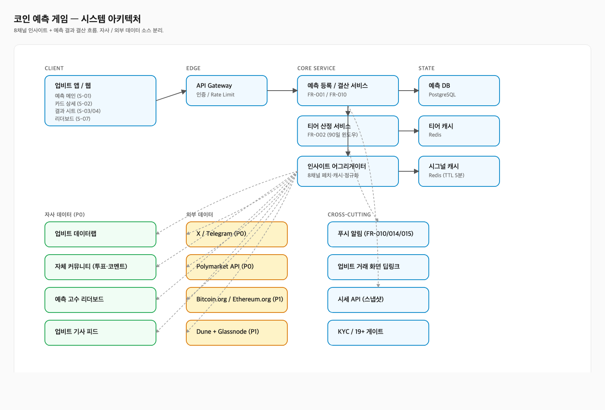
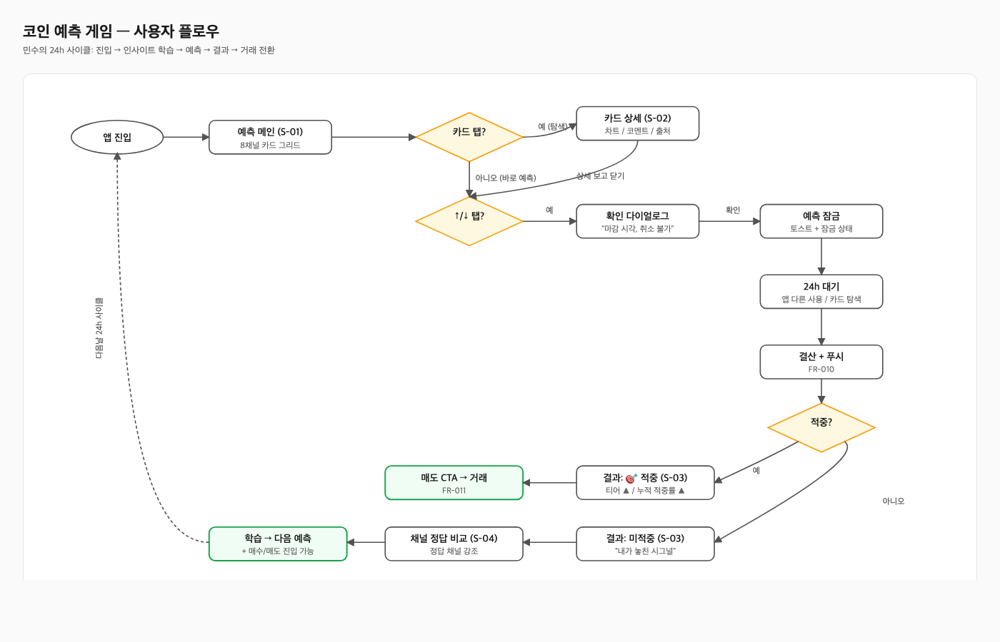
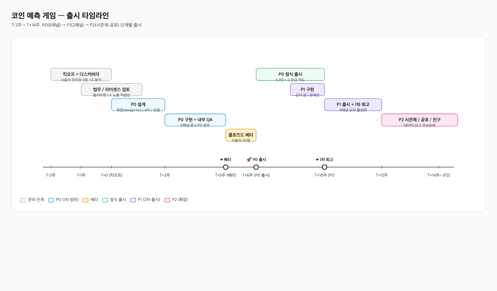
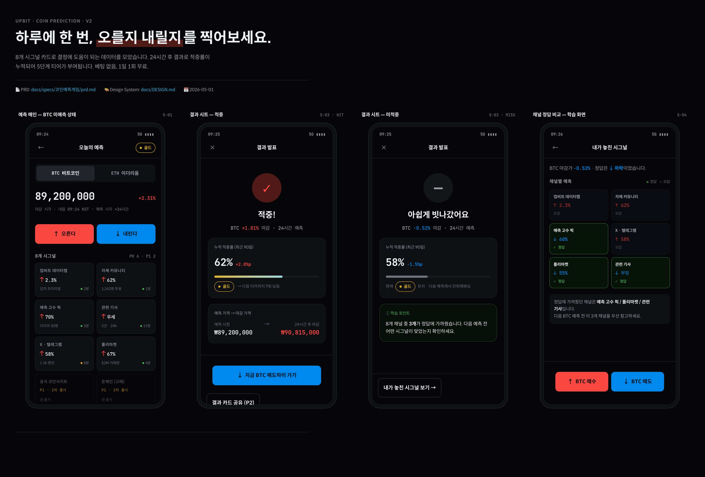

# 코인 예측 게임 v2 — 풀스택 산출물 종합 보고서

> **프로젝트**: 업비트 거래소 내 24시간 BTC/ETH ↑↓ 예측 게임 + 8채널 인사이트 카드 + 5단계 티어 시스템
> **작성일**: 2026-05-01 (KST)
> **상태**: PRD / BE-Spec / FE-Spec / QA-Spec / DESIGN.md / 디자인 갤러리 / 다이어그램 3종 모두 완료
> **다음 의존**: 법무 의견서 (Q-09, T-3주) · 거래화면팀 합의 (Q-07) · 커뮤니티 결정 (Q-08)

---

## 1. 한 눈에 보기 (At a Glance)

| 항목 | 값 |
|------|-----|
| 핵심 기능 | 매일 1회 BTC·ETH의 24h 후 ↑/↓ 예측 (베팅 X, 무료) |
| 적중 → 보상 | 5단계 티어 (브론즈/실버/골드/플래티넘/다이아몬드, 90일 슬라이딩 윈도우) |
| 인사이트 채널 | **8개** — P0 6: 데이터랩·커뮤니티·고수픽·기사·X/텔레그램·폴리마켓 / P1 2: 공식 코인사이트·온체인(Dune+Glassnode) |
| 화면 (S-01~S-07) | 예측 메인 / 카드 상세 / 결과(적중·미적중) / 채널 정답 비교 / 온보딩 / 차단 / 리더보드 |
| 비즈니스 KPI | DAU/체류시간 ↑ + 거래량 전환 (예측 → 매수/매도 8% 목표) |
| 설계 모드 | **확장(Expand)** — P0/P1/P2 19개 FR 모두 포함 |
| 메모리 규칙 | API 명세·데이터 모델·보안·런치 플랜·SP는 PRD 본문 미포함 (별도 산출물) |
| 총 산출물 분량 | **3,279줄** (PRD 788 / be-spec 1055 / fe-spec 754 / qa-spec 682) + 다이어그램 3 + 디자인 1 |

---

## 2. 산출물 인벤토리

### 2-1. 기획·디자인

| # | 파일 | 경로 | 줄/크기 | 한줄 요약 |
|---|------|------|--------|-----------|
| 1 | **PRD** | `docs/specs/코인예측게임/prd.md` | 788줄 | 14개 섹션, FR 19개(P0 11/P1 4/P2 4), 시나리오 6, 리스크 9, Open Q 9, 4-perspective 리뷰 노트 첨부 |
| 2 | **DESIGN.md** | `docs/DESIGN.md` | 230줄 | OKLCH 다크 토큰, 한국식 시세 색상(↑빨강/↓파랑), Spoqa Han Sans Neo + JetBrains Mono |
| 3 | **디자인 갤러리** | `public/designs/coin-prediction-v2.html` | 단일 HTML | 4화면 모바일 프레임 (S-01 / S-03 적중 / S-03 미적중 / S-04), 88/100 통과 |

### 2-2. 다이어그램 (HTML, inline SVG)

| # | 파일 | 경로 | 용도 |
|---|------|------|------|
| 4 | 시스템 아키텍처 | `docs/specs/코인예측게임/diagrams/architecture.html` | 8채널 데이터 소스(자사 P0 4 + 외부 P0/P1 4) + 코어 서비스 + 캐시 |
| 5 | 사용자 플로우 | `docs/specs/코인예측게임/diagrams/flowchart.html` | 24h 사이클 (앱 진입 → 카드 탐색 → 예측 → 결과 → 거래 전환 → 학습 루프) |
| 6 | 출시 타임라인 | `docs/specs/코인예측게임/diagrams/timeline.html` | T-2주 ~ T+14주, P0(T+6) → P1(T+10) → P2(T+14~) |

### 2-3. 개발 명세서 (PRD에서 도출)

| # | 파일 | 경로 | 줄/리뷰 | 핵심 |
|---|------|------|--------|------|
| 7 | **BE-Spec** | `docs/specs/코인예측게임/be-spec.md` | 1055줄 / **PASS** | API 25개, 데이터 모델 9종, 8채널 어그리게이터 + circuit breaker, NFR P95/P99 + 30K RPS 산출 근거, 동시성 10건, BE 결정 필요 15건 |
| 8 | **FE-Spec** | `docs/specs/코인예측게임/fe-spec.md` | 754줄 / **91/100** | 화면 7개, 컴포넌트 트리(BEM), API 연동 19개, progressive rendering 5단계, UI 상태 매트릭스, FE 결정 12건 |
| 9 | **QA-Spec** | `docs/specs/코인예측게임/qa-spec.md` | 682줄 / **85/100** | TC 130건(기존 40 + 추가 90), 경계값 27행, 사이드이펙트 10, 인수조건 100% 커버, 테스트 데이터 13종 |

### 2-4. 폴더 구조

```
~/projects/heka-product-harness/
├── docs/
│   ├── DESIGN.md                              ← 디자인 시스템
│   └── specs/코인예측게임/
│       ├── prd.md                             ← 기획서 (788줄)
│       ├── be-spec.md                         ← 백엔드 명세 (1055줄)
│       ├── fe-spec.md                         ← 프론트엔드 명세 (754줄)
│       ├── qa-spec.md                         ← QA 명세 (682줄)
│       ├── SUMMARY.md                         ← 본 보고서
│       ├── diagrams/
│       │   ├── architecture.html
│       │   ├── flowchart.html
│       │   └── timeline.html
│       └── screenshots/                       ← 본 보고서용 캡쳐
│           ├── architecture.png
│           ├── flowchart.png
│           ├── timeline.png
│           └── coin-prediction-v2.png
└── public/designs/
    └── coin-prediction-v2.html               ← 디자인 갤러리 (88/100)
```

---

## 3. 결정사항 핵심 요약

### 3-1. 디스커버리 답변 (Step 2)

| 질문 | 답변 |
|------|------|
| 플랫폼 | 업비트 |
| 예측 단위 시간 | 24시간 (하루 1회 무료) |
| 재화/포인트 | 베팅 없음, 누적 적중률만 |
| 비즈니스 목표 | DAU/체류시간 + 거래량 전환 |
| 대상 코인 | BTC + ETH (2종) |
| 적중 판정 | 24h 후 종가 ↑/↓ 이분법 (원 단위 동가 무효) |
| 필수 채널 | 8개 (자사 4 + X/텔레그램·폴리마켓·온체인·공식 글) |

### 3-2. 솔루션 (Step 3)

- **레이아웃**: B 카드 그리드 (8채널 4×2, 채널 간 교차검증 우선)
- **티어**: 5단계 (브론즈/실버/골드/플래티넘/다이아몬드)
- **시그널 표시**: 방향(↑/↓) + 강도(%) — 색상만으로 구분 금지

### 3-3. 4-Perspective 리뷰 종합 (Step 7.5)

| 역할 | 점수 | 핵심 |
|------|------|------|
| FE | 78 | 카드 격리·컴포넌트 토큰 강점, S-07 명세·동적 라벨 보강 필요 |
| BE | 72 | 격리 정책 일관, NFR P95/P99·캐시 TTL 표 필요 |
| QA | 78 | G/W/T 준수, **마감 시각 모순** 지적(시나리오1 vs FR-014) |
| 리더 | 72 | 격리 설계 강점, 커뮤니티 결정 시점 앞당기기 권고 |

→ **핵심 결함 6건**(시간 정책 통일·시간대 표기·S-07 누락·Q-07 추가·폴리마켓 Plan B·동가 비교 정책)을 PRD 본문에 즉시 반영. 나머지 23건은 후속 명세서로 이관 (BE/FE/QA가 각자 흡수).

### 3-4. 메모리 적용 규칙 (사용자 피드백)

PRD 본문에 다음을 **포함하지 않음**:

- ❌ 상태 관리 라이브러리 / 글로벌-로컬 분류 → FE팀 영역
- ❌ API 스키마 / 데이터 모델 → be-spec에서 도출
- ❌ 보안 기준선 / 토큰·암호화 → 별도 보안 에이전트
- ❌ 스토리 포인트 / INVEST 체크 → 개발팀 영역
- ❌ 런치 플랜 / 롤아웃 % / 롤백 트리거 → 출시 운영 계획

→ 본 PRD는 "**왜 / 무엇을**"에 집중. "**어떻게**"는 be-spec / fe-spec / qa-spec / 보안 에이전트가 분담.

---

## 4. 다이어그램

### 4-1. 시스템 아키텍처

8채널 데이터 소스를 **자사(P0 4) / 외부(P0+P1 4) / 크로스커팅** 3개 그룹으로 분리. 인사이트 어그리게이터가 모든 채널을 폴링해 시그널 캐시(Redis, TTL 5분)에 저장하며, 각 채널은 circuit breaker로 격리되어 한 채널 실패가 다른 채널을 막지 않는다.



> 원본: [`diagrams/architecture.html`](diagrams/architecture.html)

### 4-2. 사용자 플로우 (24시간 사이클)

페르소나 "민수"의 24h 사이클: 출근길 카페 진입 → 카드 탐색 → ↑/↓ 예측 → 24h 대기 → 결과 푸시 → 적중 시 매도/미적중 시 채널 정답 비교 학습 → 다음날 사이클 반복.



> 원본: [`diagrams/flowchart.html`](diagrams/flowchart.html)

### 4-3. 출시 타임라인

T-2주(킥오프) → T-1주(법무 검토) → T+0~5주(P0 설계·구현·QA) → T+5주(클로즈드 베타 50명) → **T+6주(P0 정식 출시, 6채널)** → T+10주(P1 추가, 8채널 모두 활성화) → T+14주~(P2 시즌제·공유·친구).



> 원본: [`diagrams/timeline.html`](diagrams/timeline.html)

---

## 5. 서비스 화면 (디자인 갤러리)

핵심 4화면을 모바일 프레임으로 시각화. **한국식 시세 색상**(상승=빨강 / 하락=파랑), **Spoqa Han Sans Neo + JetBrains Mono**(tabular-nums), **OKLCH 다크 테마**.



| # | 화면 | ID | 핵심 |
|---|------|-----|------|
| 1 | 예측 메인 (BTC 미예측) | S-01 | BTC/ETH 토글 → 24h 차트(스파크라인) → ↑/↓ CTA → 8채널 카드 그리드 (P0 6 활성 + P1 2 dashed 잠금) |
| 2 | 결과 시트 — 적중 | S-03 HIT | 🎯 적중 + 누적 적중률 ▲ + 다음 티어까지 N회 + **"지금 BTC 매도하러 가기"** CTA → 거래 화면 딥링크 |
| 3 | 결과 시트 — 미적중 | S-03 MISS | "아쉽게 빗나갔어요"(부정 강조 회피) + 적중률 ▼ + "내가 놓친 시그널 보기" 학습 CTA |
| 4 | 채널 정답 비교 | S-04 | 6개 채널의 예측 vs 정답을 색상(녹색=정답·회색=오답)으로 구분, 다음 예측 시 우선 참고할 3개 채널 강조 |

> 원본: [`public/designs/coin-prediction-v2.html`](../../public/designs/coin-prediction-v2.html) — 브라우저에서 열면 인터랙션과 폰트가 정확히 렌더링됨

---

## 6. 다음 단계

### 6-1. 즉시 (T-3주 ~ T-1주, 외부 합의 의존)

| 항목 | 책임자 | 데드라인 | 비고 |
|------|--------|---------|------|
| Q-09 폴리마켓 데이터 노출 적법성 의견서 | 법무팀 | **T-3주** | 부정 시 Plan B (7채널 모드) 즉시 전환 (R-01 + be-spec FeatureFlag) |
| Q-07 거래화면팀 BTC/KRW·ETH/KRW 딥링크 합의 | 거래화면팀 PM + 본 PM | **T-1주** | G2(거래량 전환) 핵심 의존 |
| Q-08 자체 커뮤니티 신규 vs 통합 결정 | 커뮤니티 PM | **T-1주** | 미정 시 P1 강등 |

### 6-2. 후속 산출물 (스킬·에이전트 영역)

- **보안 에이전트**: KYC 게이트 충분성, 디바이스/IP 어뷰징, 세션·토큰 처리
- **be-spec 결정 15건**: 기술 스택(런타임/DB/캐시/큐) 선택 → BE팀
- **fe-spec 결정 12건**: 거래화면 딥링크(Q-07 의존), 폴리마켓 빌드 분기(R-01 의존)
- **qa-spec 오픈 8건**: 무효 카운트 누적 정책, 5% 부등호 처리

### 6-3. 운영 (PRD 범위 외)

- 인플루언서 30명 큐레이션 (운영팀, 격주 갱신)
- 모더레이션 / X 멘션 사후 검수 (0.5~1 FTE)
- 출시 운영 계획 (롤아웃 % / 롤백 트리거 절차)

---

## 7. 리스크 요약 (TOP 5)

| ID | 리스크 | 영향 | 완화 |
|----|--------|------|------|
| R-01 | 폴리마켓 한국 노출 규제 | 출시 차단 | **Plan B**: 7채널 모드 즉시 전환 (FeatureFlag) |
| R-02 | X API 비용 폭증 | 월 운영비 $K | 큐레이션 인플루언서 30명 한정 + 알람 |
| R-04 | 사용자가 도박처럼 인식 | 규제 리스크 | 베팅 없음 명시, 19+ 게이트, "투자 권유 아님" 면책 |
| R-05 | 마감 직전 30분 트래픽 스파이크 | 장애 | 큐 기반 처리 + 30K RPS NFR + jitter 분산 |
| R-06 | 결과 산정 오류 (시세 깨짐) | CS 폭증 | 마감 시각 ±15초 다중 소스 평균 + 5%+ 괴리 무효 |

---

## 변경 로그

| 날짜 | 작업 | 결과 |
|------|------|------|
| 2026-04-30 | PRD 작성 (블록 1~4) + 4-perspective 리뷰 + 핵심 결함 6건 반영 | 788줄 PRD 완성, 평균 75 → 80+ |
| 2026-04-30 | 다이어그램 3종 + 디자인 갤러리 + DESIGN.md | 88/100 통과 |
| 2026-05-01 | be-spec / fe-spec / qa-spec 병렬 도출 | 3,279줄, 모두 PASS |
| 2026-05-01 | 본 SUMMARY 보고서 + 캡쳐 4종 | — |
