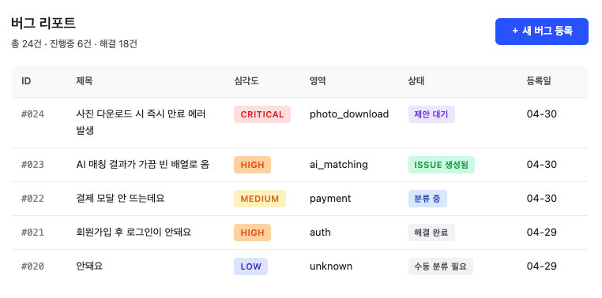
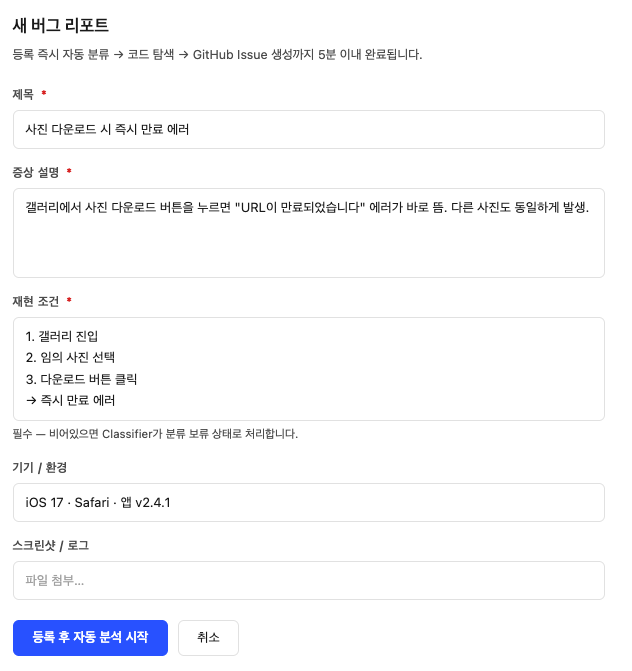
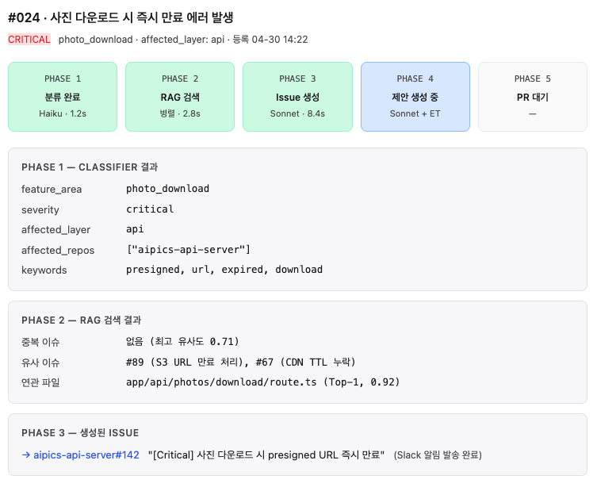
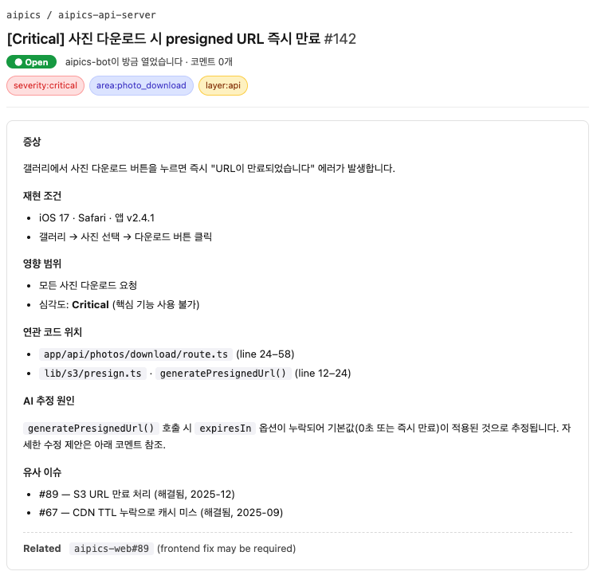
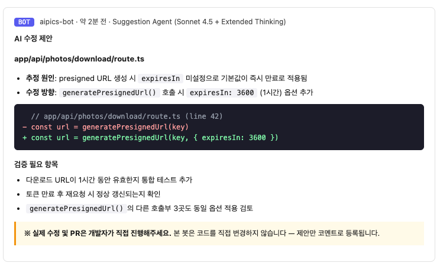

# 최종 보고 — QA 자동 이슈화 시스템

> 어드민 게시판에 등록된 자연어 버그 리포트를 자동으로 분석하여, GitHub Issue를 생성하고 코드 수정 제안까지 코멘트로 등록하는 멀티 에이전트 파이프라인.

## 1. 한 줄 정리 & 시스템 개요

어드민 게시판에 QA(버그) 등록 폼이 있고, 등록 즉시 5개의 LLM 에이전트가 **분류 → 중복 검색 → 코드 탐색 → Issue 생성 → 수정 제안** 순으로 동작한다. 개발자는 생성된 GitHub Issue와 diff 제안만 검토하면 된다.

| 구분 | 내용 |
| --- | --- |
| Input | 자연어 버그 리포트 — "사진 다운로드가 안 돼요" 한 줄도 처리 |
| Output | GitHub Issue + 수정 제안 코멘트 (레포별 1건씩, 크로스 링크 자동 첨부) |
| 동작 | 5분 이내 자동 처리 — Critical/High 버그는 diff 제안까지 |

### 왜 만드는가

솔로 개발 환경에서 사용자 버그 리포트가 들어와도 분류·재현 환경 정리·코드 위치 추적·Issue 작성이 매번 반복되는 정형화된 노동이다. 이 부분만 자동화하면 개발자는 "Issue 검토 → 수정 → PR" 단계에만 집중할 수 있다. 동시에 AI가 코드를 직접 수정하지 않게 하여 **Human-in-the-loop**는 유지한다.

---

## 2. 기술 스택

단순 분류는 Haiku, 분석·생성은 Sonnet으로 모델을 분리하여 비용을 제어한다.

| 영역 | 기술 | 비고 |
| --- | --- | --- |
| 언어 | Python 3.12+ | 에이전트 구현 |
| LLM | Claude Sonnet 4.5 / Haiku | 비용 제어를 위한 모델 분리 |
| 에이전트 프레임워크 | LangGraph | 멀티 에이전트 오케스트레이션 |
| 벡터 DB | PostgreSQL + pgvector | 코드베이스·Issue 임베딩 |
| 임베딩 | OpenAI text-embedding-3-small | 코드/이슈 벡터화 |
| 코드 인덱싱 | Tree-sitter | AST 파싱 → 함수·컴포넌트 추출 |
| GitHub 연동 | PyGithub / REST API | Issue 등록·코멘트 |
| API 서버 | FastAPI | 어드민 ↔ 에이전트 연결 |
| 어드민 게시판 | Next.js (기존 /admin) | 버그 수집 UI |
| 대상 레포 | aipics-api-server / aipics-web / inference-server | 멀티 레포 구성 |

---

## 3. 전체 플로우 (Phase 1 ~ 5)

버그 리포트 1건 = 파이프라인 1회 실행. **함수형 단발 실행 구조**로, 상태 유지·재시도·캐싱 인프라 없음. 단순함 우선.

### Phase 1 — 버그 접수 및 자동 분류

어드민 게시판에서 버그 등록 → Classifier Agent (Haiku) 즉시 트리거. 기능 영역·심각도·영향 레이어·대상 레포를 JSON으로 출력.

```
[어드민 등록]
  → POST /api/admin/bugs
  → Classifier Agent (Haiku)
      ├─ unknown + low → 조기 종료 (비용: Haiku ×1)
      └─ 그 외        → Phase 2 진행
```

### Phase 2 — 중복 감지 + 코드 탐색 (병렬)

Issue RAG (LLM 없음) + Code RAG (pgvector → Haiku 리랭킹) 병렬 실행. 유사도 0.95↑ 중복은 즉시 종료, 연관 파일 0건이면 Suggestion Agent 스킵 플래그.

```
[Classifier 결과]
  ├──▶ [Issue RAG]   pgvector 유사도 검색 (LLM 호출 없음)
  └──▶ [Code RAG]    pgvector + Haiku 리랭킹 (Top-3)
           │
           ├─ 중복(0.95↑) → 기존 이슈 링크 등록 후 종료
           └─ 그 외       → Phase 3 진행
```

### Phase 3 — GitHub Issue 생성

각 에이전트의 압축 출력만 사용. `affected_repos`가 N개면 동일 타이틀로 N개 레포에 Issue를 등록하고 본문 하단에 크로스 링크를 자동 첨부.

```
[Issue Generator (Sonnet 4.5)]
  ├─ repos = 1개 → 해당 레포 Issue 1건
  └─ repos = N개 → 동일 타이틀로 각 레포 Issue N건
                   (본문에 크로스 링크 자동 첨부)
  → 어드민 status: "issue_created"
  → Slack 알림
```

### Phase 4 — 수정 제안 코멘트 등록 (조건부)

어드민 검토 승인 후 실행. severity = critical/high이고 affected_layer ≠ inference일 때만 호출. 함수 블록 Top-3 기반 diff 제안을 Issue 코멘트로 등록. **실제 브랜치·커밋·PR 없음.**

```
[어드민 검토 후 승인]
  → severity 확인
      ├─ medium / low                  → 호출 없음 (비용 0)
      └─ critical / high (≠ inference) → Suggestion Agent 실행
           → 함수 블록 Top-3 → diff 제안 코멘트 등록
           → 어드민 status: "suggestion_ready"

extended thinking: critical만 활성화
```

### Phase 5 — 이력 저장

PR 머지 webhook 수신 시 버그 DB status = "resolved", 해결된 Issue를 Issue RAG 벡터스토어에 증분 추가.

```
[PR 머지 webhook]
  → 버그 DB status = "resolved"
  → 해결된 Issue → Issue RAG pgvector 증분 추가
```

---

## 4. 5개 에이전트 역할

"LLM을 쓰지 않을 수 있는 단계는 무조건 쓰지 않는다"는 원칙으로 에이전트별 모델·입출력 분리.

### 1. Classifier Agent — Haiku

- **역할**: 자연어 버그 리포트를 파싱해 기능 영역·심각도·영향 레이어·대상 레포를 구조화
- **출력**: `{ feature_area, severity, affected_layer, affected_repos[], keywords }`
- **비용 제어**: Haiku, JSON 최소 필드, Few-shot 2개, Prompt Caching 적용

### 2. Issue RAG Agent — No LLM

- **역할**: 기존 GitHub Issues를 벡터 검색해 중복을 감지하고 유사 이슈 컨텍스트를 복원
- **출력**: `{ duplicate_issue?, similar_issues[], past_fix_summaries[] }`
- **비용 제어**: pgvector 코사인 유사도만 사용 — LLM 비용 0. 0.95↑ 중복은 즉시 종료

### 3. Code RAG Agent — Haiku

- **역할**: 분류 결과로 관련 소스 파일·함수·API·컴포넌트를 레포별로 매핑
- **출력**: `{ affected_files[], api_endpoints[], components[] }`
- **비용 제어**: 1차 pgvector Top-5 → 2차 Haiku 리랭킹 Top-3. 함수 메타만 전달 (파일 전체 금지)

### 4. Issue Generator Agent — Sonnet 4.5

- **역할**: 분석 결과를 종합해 레포별 GitHub Issue 초안을 생성·등록
- **출력**: GitHub Issue URL 목록 (레포별 1건)
- **비용 제어**: Issue 템플릿 Prompt Caching prefix 고정. 압축된 입력만 사용 (원문·파일 원본 미포함)

### 5. Suggestion Agent — Sonnet 4.5 + Extended Thinking (조건부)

- **역할**: Issue 기반 파일별 수정 제안을 생성해 Issue 코멘트로 등록. **실제 코드 변경 없음.**
- **실행 조건**: severity = critical/high · affected_layer ≠ inference · Code RAG 결과 1건 이상
- **비용 제어**: 함수 블록 Top-3만 컨텍스트, medium/low는 호출 자체 없음, extended thinking은 critical만

---

## 5. 동작 화면

사용자(개발자) 관점에서 보게 되는 5개 화면.

### ① 어드민 게시판 — 버그 리포트 목록




> 상태 컬럼은 파이프라인 진행 단계를 실시간 반영 (분류 중 → Issue 생성 → 제안 대기 → 해결 완료)

### ② 버그 등록 폼




> 재현 조건·기기 환경 필드를 강제하여 "안 돼요" 한 줄짜리 리포트로 인한 분류 실패를 줄임

### ③ 분석 진행 상황 (버그 상세)





> 각 Phase별 LLM 사용 모델·소요 시간 표시. 실패 시 해당 단계만 재시작 가능.

### ④ 자동 생성된 GitHub Issue





> 템플릿 prefix는 Prompt Caching으로 고정. 멀티 레포 영향 시 본문 하단 Related 자동 첨부.

### ⑤ 수정 제안 코멘트





> 함수 블록만 컨텍스트로 사용 (파일 전체 미포함). diff + 검증 체크리스트가 항상 함께 등록됨.
